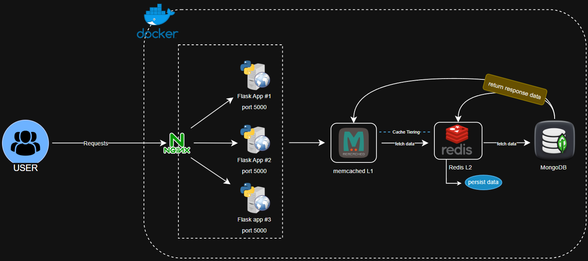

memcached-lab/
├── app/
│   ├── app.py
│   │── Dockerfile
│   └── requirements.txt
├── conf.d/
│   └── nginx.conf
├── cache_redis/
├── logs/
│   └── nginx/
├── init-mongo.js
├── docker-compose.yml
└── README.md

## Docker Cache Tiering

