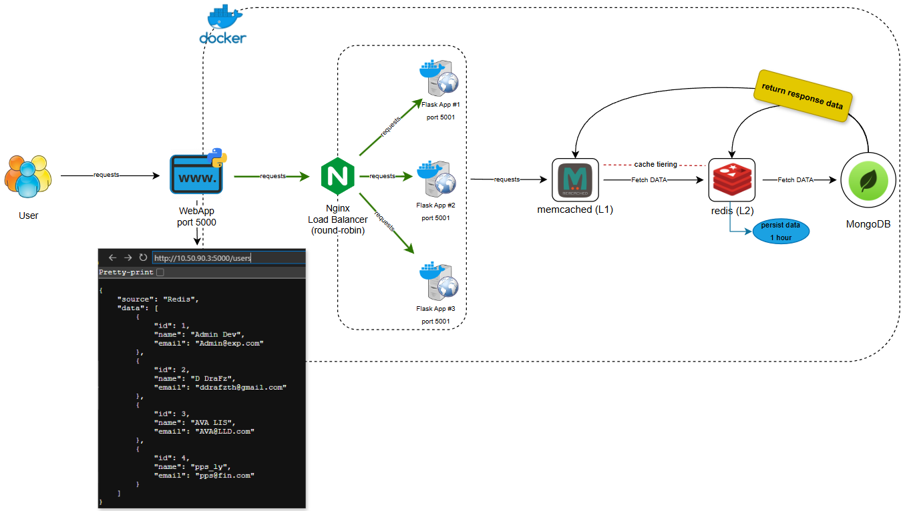

## Docker Cache Tiering: Python Flask, Nginx, Memcached, Redis, MongoDB

## Project Overview
* This project is designed to cache user data using a cache tiering technique between Memcached (L1) and Redis (L2), running on Docker.

## How It Works
* Users send requests through an Nginx load balancer with 3 nodes (round-robin strategy) to distribute traffic evenly.
* The request first checks L1 (Memcached) for cached data.
* If the data is not found in L1, it queries L2 (Redis).
* If the data is still not available in L2, it fetches it from the database (DB).
* The DB returns the data, and the system stores it in both L2 (Redis) and L1 (Memcached) for future requests.

## Failure Scenarios
* If L1 (Memcached) is down, requests will still fetch data from L2 (Redis).
* When L1 is back online, it resumes normal operations.
* If L2 (Redis) is down but data exists in L1, the system continues working normally.
* If both L1 and L2 are down, the cache system fails—urgent action is required.

## Diagram


## Structure docker cache tiering
memcached-lab/ \
├── app/ \
│   ├── app.py \
│   │── Dockerfile \
│   └── requirements.txt \
├── conf.d/ \
│   └── nginx.conf \
├── cache_redis/ \
├── logs/ \
│   └── nginx/ \
├── init-mongo.js \
├── docker-compose.yml \
└── README.md

## if cloned into server, please rename ddrafz-mbl-docker-cachetiering-pj to memcached-lab
```
mv ddrafz-mbl-docker-cachetiering-pj memcached-lab
```
```
cd memcached-lab
```
Run docker compose:

build test to see logs:
```
docker compose up --build --scale web=3
```
build to detach:
```
docker compose up --build --scale web=3 -d
```
Open web browser:
list users all:
```
http://localhost:5000/users
```
user 1-4:
```
http://localhost:5000/user/1
```
```
http://localhost:5000/user/2
```
```
http://localhost:5000/user/3
```
```
http://localhost:5000/user/4
```

Edit user 1:
```
curl -X PUT http://localhost:5000/edit_user/1 -H "Content-Type: application/json" -d '{"id":1,"name":"criminal","email":"criminal@admin.com"}'
```
Add User 5:
```
curl -X POST http://localhost:5000/add_user -H "Content-Type: application/json" -d '{"id":5,"name":"accord prom","email":"accord@unidev.com"}'
```

Delete User 1-5:
```
curl -X DELETE http://localhost:5000/delete_user/1
```
```
curl -X DELETE http://localhost:5000/delete_user/2
```
```
curl -X DELETE http://localhost:5000/delete_user/3
```
```
curl -X DELETE http://localhost:5000/delete_user/4
```
```
curl -X DELETE http://localhost:5000/delete_user/5
```
