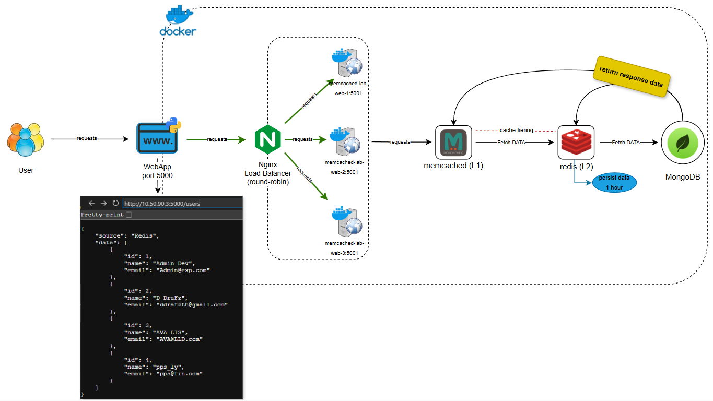

## Docker Cache Tiering


## if cloned into server, please rename ddrafz-mbl-docker-cachetiering-pj to memcached-lab

mv please rename ddrafz-mbl-docker-cachetiering-pj memcached-lab
```
cd memcached-lab
```

## Prerequisites installation

Install Required Python Libraries: \
You can install the required libraries using pip:
```
sudo pip install Flask==2.3.2
```
```
sudo pip install pymongo==4.3.3
```
```
sudo pip install pylibmc==1.6.3
```
```
sudo pip install redis==5.2.1
```

Run docker compose:

build test to see logs:
```
docker compose up --build --scale web=3
```
build to detach:
```
docker compose up --build --scale web=3 -d
```
Open web browser:
list users all:
```
http://localhost:5000/users
```
user 1-4:
```
http://localhost:5000/user/1
```
```
http://localhost:5000/user/2
```
```
http://localhost:5000/user/3
```
```
http://localhost:5000/user/4
```

Edit user 1:
```
curl -X PUT http://localhost:5000/edit_user/1 -H "Content-Type: application/json" -d '{"id":1,"name":"criminal","email":"criminal@admin.com"}'
```
Add User 5:
```
curl -X POST http://localhost:5000/add_user -H "Content-Type: application/json" -d '{"id":5,"name":"accord prom","email":"accord@unidev.com"}'
```

Delete User 1-5:
```
curl -X DELETE http://localhost:5000/delete_user/1
```
```
curl -X DELETE http://localhost:5000/delete_user/2
```
```
curl -X DELETE http://localhost:5000/delete_user/3
```
```
curl -X DELETE http://localhost:5000/delete_user/4
```
```
curl -X DELETE http://localhost:5000/delete_user/5
```
